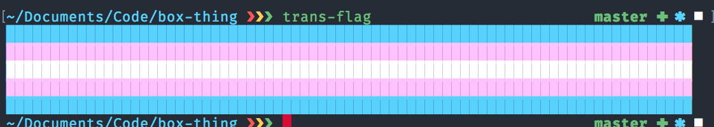

# Trans flag printer

I made this when I drank too much coffee, and I wanted to learn how you
do things like get the dimensions of the terminal.

It prints a trans flag as wide as the terminal.
 
# Running

```shell
$ rustup run stable cargo install 
$ trans-flag
```

